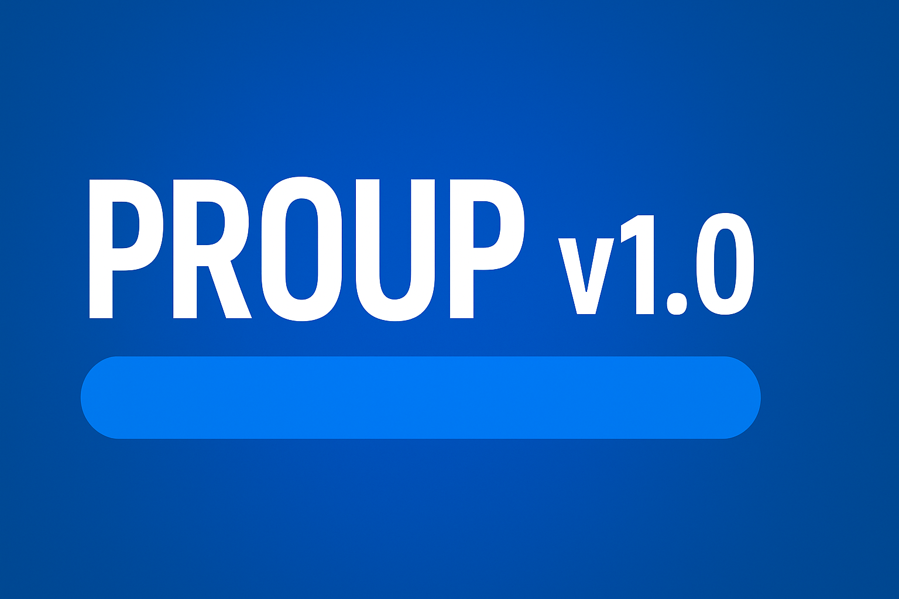
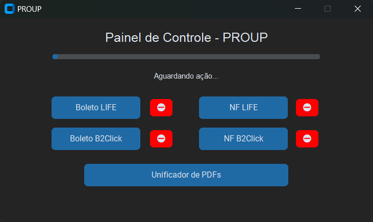

# PROUP  


## 🧾 Descrição  
O **PROUP** é um programa desenvolvido em Python com interface gráfica usando *CustomTkinter*, criado para **ler, renomear, organizar e unificar PDFs** (notas fiscais, boletos) automaticamente.  
O sistema simplifica tarefas repetitivas, reduz erros de nomeação e facilita a gestão de documentos em lote.

---

## ⚙️ Requisitos  
- Python 3.10 ou superior  
- Bibliotecas Python usadas:
  ```bash
  pip install customtkinter pytesseract pdf2image PyPDF2 pandas pyautogui pillow
Ferramentas externas:

Poppler para Windows (necessário para conversão de PDF para imagem)

Tesseract OCR (necessário para leitura de texto dos PDFs)

Estrutura de pastas esperada no Windows:

text
Copiar código
C:\Renomeador_Boleto_pdf
C:\Renomeador_NF_pdf
C:\Unificador_pdf
💻 Como usar
Clone ou faça download do repositório:

bash
Copiar código
git clone https://github.com/MarlonProgetti/PROUP.git
Abra o terminal ou prompt no diretório do projeto e instale as dependências listadas acima.

Ajuste, se necessário, os caminhos internos no script (ex: poppler_path, pytesseract.pytesseract.tesseract_cmd).

Coloque os arquivos PDF que deseja processar nas pastas conforme o tipo (boleto ou nota fiscal).

Execute o script principal (por exemplo python PROUP.py).

Escolha a funcionalidade desejada na interface:

Boleto LIFE

NF LIFE

Boleto B2Click

NF B2Click

Unificador de PDFs (use a pasta C:\Unificador_pdf para todos os PDFs a serem unidos)

Acompanhe o status e a barra de progresso na interface gráfica.

O programa irá renomear automaticamente os arquivos conforme a loja/CNPJ detectado e/ou gerar um PDF unificado conforme opção.

📊 Estrutura do projeto
Arquivo	Função
PROUP.py (ou nome do arquivo principal)	Interface de controle principal
Funções internas	Processamento dos PDFs — renomeação, extração de CNPJ, unificação
thumbnail.png	Capa usada no README
Outros arquivos suportes	Imagens, dicionário de CNPJs, etc.

🔄 Fluxo de Funcionamento
O usuário inicia o aplicativo via interface.

Seleciona a função desejada (boleto, nota fiscal, unificação).

O sistema realiza OCR no(s) PDF(s), detecta CNPJ ou número inicial conforme tipo.

Renomeia/organiza os arquivos automaticamente ou une-os em um único PDF.

O status final é exibido na interface com mensagem de conclusão.

🧩 Observações Técnicas
Certifique-se de instalar Poppler e Tesseract OCR corretamente e definir os caminhos no código:

python
Copiar código
poppler_path = r"C:\poppler\poppler-25.07.0\Library\bin"
pytesseract.pytesseract.tesseract_cmd = r"C:\Program Files\Tesseract-OCR\tesseract.exe"
Todos os scripts internos podem ser executados individualmente ou via a interface unificada.

Em caso de travamento ou operação indesejada, utilize o botão "⛔" para interromper o processamento.

📜 Licença
Este projeto está licenciado sob a MIT License. Veja o arquivo LICENSE para mais detalhes.

👨‍💻 Autor
Desenvolvido por Marlon Progetti
📅 Ano: 2025
🔖 Versão: 1.0

🔖 Badges (opcional)
          .
“Automação não é só para grandes sistemas — é também para pequenas tarefas que se repetem todos os dias.”
— Marlon Progetti
