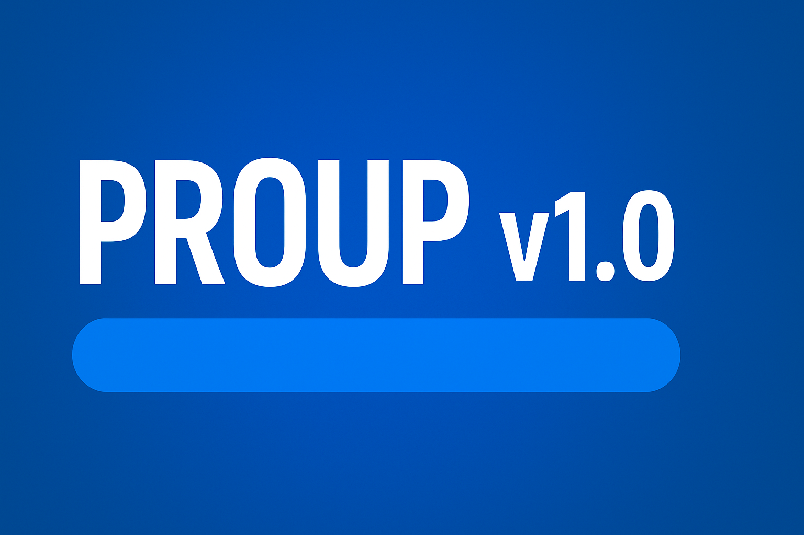
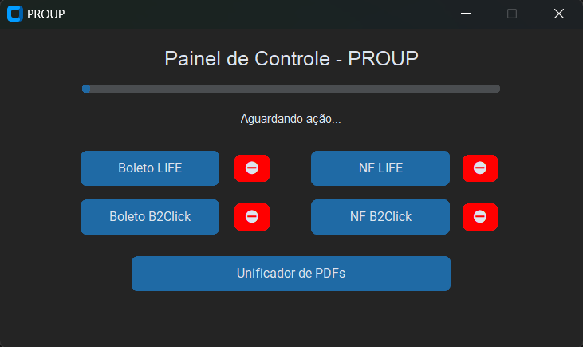

# PROUP  


## 🧾 Description  
**PROUP** is a Python application with a graphical interface built using *CustomTkinter*, designed to **read, rename, organize and merge PDF files** (invoices, bills) automatically.  
The system simplifies repetitive tasks, reduces naming erros and improves batch document management.

---

## ⚙️ Requirements  
- Python 3.10 or higher  
- Required Python libraries:
  ```bash
  pip install customtkinter pytesseract pdf2image PyPDF2 pandas pyautogui pillow
External tools:

Poppler for Windows (required for PDF-to-Image conversion)

Tesseract OCR (required for extracting text from PDFs)

Espected Folder Structure on Windows:

text
Copy cody
C:\Renomeador_Boleto_pdf
C:\Renomeador_NF_pdf
C:\Unificador_pdf

## 💻 How to use
Clone or download the repository:

bash
Copy code
git clone https://github.com/MarlonProgetti/PROUP.git
Open a terminal or command prompt in the project directory and install the required dependences listed above.

If necessary, adjust the internal paths in the script (ex: poppler_path, pytesseract.pytesseract.tesseract_cmd).

Place the PDF files you want to process into the appropriate folders based on their type (bills or invoices)

Run the main script (for exemple: python PROUP.py).

Select the desired functionality in the graphical interface:

Boleto LIFE

NF LIFE

Boleto B2Click

NF B2Click

Unificador de PDFs (use the folder C:\Unificador_pdf for all PDFs to be merged)

Monitor the process status and progress bar in the graphical interface.

The programwill automatically rename the files based on the detected store/CNPJ and/or generate a merged PDF according to selected option.

## 📊 Project Structure
File Description

PROUP.py (or main aplication file) Main control and Graphical interface.

Internal functions PDF Processing: renaming, CNPJ extraction, and merging.

thumbnail.png	Cover image used in the README.

Other supporting files, Images, CNPJ dictionary, configuration files, etc.

## 🔄 Application Workflow

The user lauches the aplication through the graphical interface.

Selects the desired function (bills, invoices or PDF merge).

The System performs ORC on the PDFs files, and detects the CNPJ or initial document number based on the selected.

Files are automatically renamed and organized, or merge into a single PDF.

The final status is displayed in the graphical interface with completion messege.

## 🧩 technical Observations 

Make sure **Poppler** and **Tesseract ORC** are correctly installed and that their are properly configured in the code:

python
Copy code:
poppler_path = r"C:\poppler\poppler-25.07.0\Library\bin"
pytesseract.pytesseract.tesseract_cmd = r"C:\Program Files\Tesseract-OCR\tesseract.exe"

All internal scripts can be executed individually or through the unified graphical interface.

In case of freezing or unexpected behavior, use the "⛔" Stop buttom to interrupt the process.

## 📜 License

This project is licensed under the MIT license. See the file LICENSE for more details.

## 👨‍💻 Author

Developed by **Marlon Progetti**

📅 Year: 2025
🔖 Version: 1.0



"Automation isn't only for large systems, it is also for small tasks that repeat every day."

— Marlon Progetti
